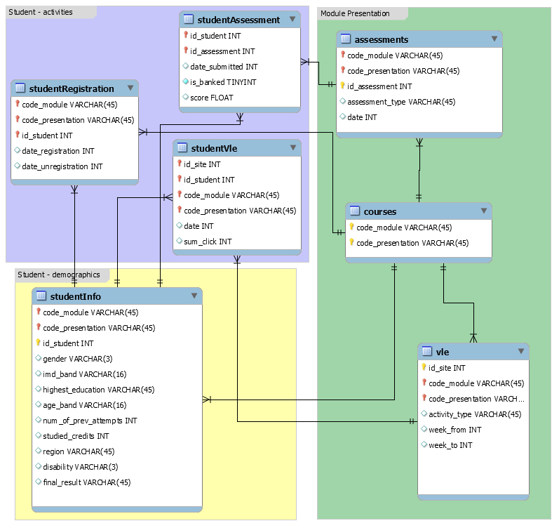

<div align="center">

</div>

***
<h2>
Introduction
</h2>

<p>
Nowadays, Massive Open Online Course systems have gained lots of attention and are used in different levels of education. MOOCs are a recent and widely researched development in distance education, first introduced in 2006 and emerged as an accessible mode of learning in 2012. Analyzing workload and user characteristics of these systems can facilitate designing persuasive and more beneficial systems.
In this project, I use [OULAD](https://analyse.kmi.open.ac.uk/open_dataset), which is the anonymized Open University Learning Analytics Dataset (OULAD).

I mainly focus on the following insights.

• [*Long-term popularity evolution of a course based on registration*](#q1)

• [*The relation between students' assessments and use of online resources*](#q2)

• [*The relation between quality and quantity of online resources and students' assessments*](#q3)

• [*Temporal patterns of time spent in MOOCs*](#q4)

• [*Students' characteristics impacting online usage of resources*](#q5)
</p>

***
<h2>
Dataset
</h2>

<p>
The [OULAD](https://analyse.kmi.open.ac.uk/open_dataset) dataset contains data about courses, students and their interactions with Virtual Learning Environment (VLE) for seven selected courses (called modules). The dataset consists of several files:

• courses.csv - the list of all available modules and their presentations.

• assessments.csv - information about assessments in module-presentations. Usually, every presentation has several assessments, followed by the final exam.

• vle.csv -  information about the available materials in the VLE. Typically these are HTML pages, pdf files, etc. Students have access to these materials online, and their interactions with the elements are recorded.

•  studentInfo.csv - demographic information about the students together with their results.

• studentRegistration.csv - information about the time when the student registered for the module presentation. 

• studentAssessment.csv - the results of students’ assessments.

• studentVle.csv - information about each student’s interactions with the materials in the VLE.

This dataset has 7 modules, 32593 students, with 6364 online resources and 10655280 interaction records.

The database schema is as follows:

<div align="center">

</div>

</p>

***

<h2> <a name="q1"></a> 
Long-term popularity evolution of courses based on registration
</h2>

<p>
For this project, I use [R language](https://www.r-project.org/), which is an environment for statistical computing and graphics. 

In order to extract the popularity of courses, I used data from studentRegistration.csv and count the number of registered students, for each class, across different terms.
</p>

```{r, message=FALSE, warning=FALSE, comment=NA}
library(readr)

oulad_assessments = readr::read_csv("data/anonymisedData/assessments.csv")
oulad_courses = readr::read_csv("data/anonymisedData/courses.csv")
oulad_studentAssessment = readr::read_csv("data/anonymisedData/studentAssessment.csv")
oulad_studentInfo = readr::read_csv("data/anonymisedData/studentInfo.csv")
oulad_studentRegistration = readr::read_csv("data/anonymisedData/studentRegistration.csv")
oulad_studentVle = readr::read_csv("data/anonymisedData/studentVle.csv")
oulad_vle = readr::read_csv("data/anonymisedData/vle.csv")
```

```{r, message=FALSE, warning=FALSE, comment=NA}
library(dplyr)
library(highcharter)

oulad_course_popularity <- oulad_studentRegistration %>% group_by(code_module, code_presentation) %>% summarise(count = n())
oulad_course_popularity <- with(oulad_course_popularity, oulad_course_popularity[order(code_presentation, code_module, count),])

mean_student_registration = mean(oulad_course_popularity[['count']])

oulad_course_popularity  %>% mutate(code_presentation = ifelse(code_presentation == '2013B', '2013January', ifelse(code_presentation == '2013J', '2013September', ifelse(code_presentation == '2014B', '2014January', '2014September')))) %>% 
  hchart(type = "line", hcaes(x = code_presentation, y = count, group = code_module)) %>% 
  hc_yAxis(title = list(text = "Popularity"), tickInterval = 100,
           plotLines = list(list(color = "#FF0000", width = 2, value = mean_student_registration, dashStyle = 'shortdash'))
           ) %>% 
  hc_xAxis(title = list(text = "Term"), categories= list('2013January','2013September','2014January','2014September')) %>% 
  hc_title(text = "Course Popularity based on number of Student Registration", style = list(fontWeight = "bold"))
```

<p>
As we can see in this chart, more than average popular courses, which are divided by the red line, have more students in September terms due to a higher number of admissions in Fall terms compared to Winter terms. However, less popular courses don't follow such a pattern and even lose their popularity as time goes by.
</p>

<h3>
Courses online resource summary
</h3>

<p> 
In the following section, a summary of data is extracted to get more familiar with the types and quantity of online resources.
</p>

```{r, message=FALSE, warning=FALSE, comment=NA}
oulad_vle_summary <- oulad_vle %>% group_by(code_module, code_presentation, activity_type) %>% summarise(count = n())
```

<h4>
Number of courses online resources across 4 terms:
</h4>

```{r, message=FALSE, warning=FALSE, comment=NA}
knitr::kable(oulad_vle_summary %>% group_by(code_module) %>% summarise(count = n()), col.names = c("Course Name", "Number of Online Resources"))
```

<h4>
Online resource popularity across 4 terms:
</h4>

```{r, message=FALSE, warning=FALSE, comment=NA}
hchart(oulad_vle_summary %>% group_by(activity_type) %>% summarise(count = n()), "treemap", hcaes(x = activity_type, value = count, color = count), name = 'count')
```
<p>
As we can see in this treemap, instructors mostly used forums and homepages for their courses and external quiz and showing the activity of the course module has the least usage.
</p>

<h4>
Usage of online resources across terms:
</h4>

```{r, message=FALSE, warning=FALSE, comment=NA}
library("viridis")
library(purrr)

fntltp <- JS("function(){
  return this.series.yAxis.categories[this.point.y] + ':<br>' +
  Highcharts.numberFormat(this.point.value, 2);
}")

oulad_act <- oulad_studentVle %>% group_by(id_student, id_site, code_module, code_presentation) %>% summarise(clicks = sum(sum_click)) %>% inner_join(oulad_vle, by = c("id_site", "code_module", "code_presentation")) %>% group_by(code_module, activity_type, code_presentation) %>% summarise(clicks = sum(clicks)) %>% mutate(code_presentation = ifelse(code_presentation == '2013B', '2013January', ifelse(code_presentation == '2013J', '2013September', ifelse(code_presentation == '2014B', '2014January', '2014September'))))

map(unique(oulad_act$code_presentation), function(x){
  oulad_act %>% filter(code_presentation == x) %>% 
    hchart(., "heatmap", hcaes(x = code_module, y = activity_type, value = clicks)) %>%
    hc_colorAxis(stops = color_stops(10, rev(inferno(10))), type = "logarithmic") %>% 
    hc_yAxis(title = list(text = "Resource Type"), reversed = TRUE, tickLength = 0, 
             gridLineWidth = 0, minorGridLineWidth = 0, 
             labels = list(style = list(fontSize = "8px"))) %>% 
    hc_xAxis(title = list(text = "Course")) %>% 
    hc_tooltip(formatter = fntltp) %>% 
  hc_title(text = paste("Heatmap of resource clicks in \n", x)) %>% 
  hc_legend(layout = "vertical", verticalAlign = "top",
            align = "right", valueDecimals = 0) %>% 
  hc_size(height = 800)
  }) %>% 
  hw_grid(rowheight = 300) %>% htmltools::browsable()
```

<p>
As we can see in these charts, these resources might even have more than 2 million clicks during the term, which relies on different factors such as quality of the material, level of interaction needed for these resources and even students registered for such courses. Forums and homepages have the most clicks for all courses across different terms; Homepages are the only way to access other online material so that they would gain lots of clicks inevitably. However, forums have more clicks, due to their useful data such as clarifications and further explanations. One interesting finding is that in the previous section, external quizzes were merely provided by the instructor. In contrast, these quizzes have more clicks compared to more popular course materials such as a glossary, etc.

Consequently, instructors may use more persuasive materials such as quizzes to make students utilize practise the course materials.

In the following part, the efficacy of the online resources will be explored.
</p>

***
<h2> <a name="q2"></a>
The relation between students' assessments and usage of online resources
</h2>

<p>
One challenge in usage analysis is to provide a unified measure for the usage of online resources because different courses have different resources and containing more resources might result in more clicks, which is not a good measure for utilization of the resources. So, I normalized the summation of clicks by calculating the rate of clicks per resource, which is called usage in the following analyzes.

Furthermore, the students are divided by their usage into two groups of "low resource users" who use the system less than average and "high resource user" who use the system more.
</p>
```{r, message=FALSE, warning=FALSE, comment=NA}
library(ggplot2)

oulad_student_vle_summary <- oulad_studentVle %>% group_by(id_student, code_module, code_presentation) %>% summarise(clicks = sum(sum_click))

oulad_vle_course_summary <- oulad_vle %>% group_by(code_module, code_presentation) %>% summarise(count = n())

oulad_full_vle_summary <- inner_join(oulad_student_vle_summary, oulad_vle_course_summary, by = c("code_module", "code_presentation")) %>% mutate(usage = clicks*100/count)

oulad_full_student_assessment <- inner_join(oulad_assessments, oulad_studentAssessment, by = 'id_assessment')

oulad_vle_assessment <- inner_join(oulad_full_vle_summary, oulad_full_student_assessment, by = c("id_student", "code_module", "code_presentation")) %>% mutate(weight_score = weight*score)%>% group_by(id_student, code_module, code_presentation) %>% summarise(score = sum(weight_score), weight = sum(weight), usage = mean(usage)) %>% mutate(final_score = score/weight)
oulad_vle_assessment <- na.omit(oulad_vle_assessment)

mean_vle_usage <- mean(oulad_vle_assessment[['usage']])
oulad_vle_less_use <- oulad_vle_assessment %>% filter(usage <= mean_vle_usage) %>% mutate(type = 'low resource user')
oulad_vle_more_use <- oulad_vle_assessment %>% filter(usage > mean_vle_usage) %>% mutate(type = 'high resource user')

oulad_full_vle_assessment <- rbind(oulad_vle_less_use, oulad_vle_more_use)
oulad_full_vle_assessment <- na.omit(oulad_full_vle_assessment)

p <- ggplot(oulad_full_vle_assessment,aes(x = final_score, fill = type)) + geom_density(alpha= 0.4) + ggtitle("Density of Students' Scores Based on Usage of Resources") + xlab("Student Final Score")
p
```
<p>
As we can see in this chart, students who make use of resources more, pink curve, have higher scores compared to others with low usage of resources, blue curve. So as to statistically examine this claim, a t-test will be applied.
</p>

<p>
Our Hypothesis is: *Students who use online resources more would have better scores.*
<br>
To test such a Hypothesis, we conduct a Welch two-sample t-test. We test whether students with low usage of online resources would have better scores.
</p>

```{r, message=FALSE, warning=FALSE, comment=NA}
t.test(oulad_vle_less_use$final_score, oulad_vle_more_use$final_score, alternative = 'less')
```
<p>
As we can see here, the probability that the students with low usage of online resources would have more scores than the other group is low enough to refute our hypothesis. So usage of online resources impacts the score of students. 

This finding shows the necessity of persuasive systems for attracting students to the resource to enhance the efficiency of MOOCs.
</p>

***
<h2> <a name="q3"></a>
The relation between characteristics of online resources and students' assessments
</h2>

<p>
In the following section, the correlation between students' assessments and characteristics of online resources such as usage of resources and the number of resources would be investigated.
</p>

```{r, message=FALSE, warning=FALSE, comment=NA}
library(corrplot)

oulad_course_vle <- oulad_vle_summary %>% group_by(code_module, code_presentation) %>% summarise(resource_count = sum(count))

oulad_full_course_vle <- oulad_full_vle_assessment %>% group_by(code_module, code_presentation) %>% summarise(mean_score = mean(final_score), usage = mean(usage)) %>% inner_join(oulad_course_vle, by = c("code_module", "code_presentation"))

cor_course_data <- cor(data.matrix(oulad_full_course_vle %>% ungroup() %>% mutate(code_module = factor(code_module), code_presentation = factor(code_presentation))))
colnames(cor_course_data) <- c("Course Name", "Term", "Average Score", "Online Resource Usage", "Number of Resources")
rownames(cor_course_data) <- c("Course Name", "Term", "Average Score", "Online Resource Usage", "Number of Resources")
corrplot(cor_course_data, method = "color", tl.cex = 0.75/par("cex"), cl.cex = 0.75/par("cex"), title='Correlation plot of students\' assessments and resources characteristics', mar=c(0,0,1,0))
```
<p>
As we see in this chart, the average score of courses has a noticeable correlation with "Online resource usage", "Course name" and inverse relation with "Number of resources". This implies that scores mostly rely on the usage of online resources rather than the quantity of these resources. So we statistically examine this claim.
</p>

<h3>
The relation between number of online course material and the students' final results
</h3>

<p>
Our Hypothesis is: *Courses that have more online resources would have a better score.*
<br>
Concerning to test such a Hypothesis, we conduct a Welch two-sample t-test. We test whether courses with low number of online resources would have better scores.
</p>
```{r, message=FALSE, warning=FALSE, comment=NA}
mean_course_count <- mean(oulad_full_course_vle[['resource_count']])

oulad_course_less_resource <- oulad_full_course_vle %>% filter(resource_count <= mean_course_count) %>% mutate(type = 'Little number of resource')
oulad_course_more_resource <- oulad_full_course_vle %>% filter(resource_count > mean_course_count) %>% mutate(type = 'High number of resource')


t.test(oulad_course_less_resource$mean_score, oulad_course_more_resource$mean_score, alternative = 'greater')
```

<p>
As we can see here, the probability that the courses with low quantity of resources would result in lower students' scores isn't low enough to refute our Hypothesis, so we can't infer such relation.

Moreover, we can see that the mean of final scores with a lower number of resources is even slightly more than courses with a higher number of resources. This means that the high number of resources is an inverse factor for students as they would struggle to find more advantageous material in their limited time.
</p>

<h3>
The relation between usage of online course material and the students' final results
</h3>

<p>
Our Hypothesis is: *Courses who have more online resources usage would have a better score.*
<br>
In order to test such a Hypothesis, we conduct a Welch two-sample t-test. We test whether courses with low online resources usage would have better scores.
</p>

```{r, message=FALSE, warning=FALSE, comment=NA}
mean_course_usage <- mean(oulad_full_course_vle[['usage']])

oulad_course_less_resource <- oulad_full_course_vle %>% filter(usage <= mean_course_count) %>% mutate(type = 'Low usage')
oulad_course_more_resource <- oulad_full_course_vle %>% filter(usage > mean_course_count) %>% mutate(type = 'High usage')


t.test(oulad_course_less_resource$mean_score, oulad_course_more_resource$mean_score, alternative = 'less')
```

<p>
As we can see here, the probability that the courses with low usage of online resources would result in lower students' scores is low enough to refute our hypothesis. 

So we can infer that this is a matter of quality rather than quantity. The number of resources isn't critical, but resources should be helpful for the student to result in better scores.
</p>

***
<h2> <a name="q4"></a>
Temporal patterns of time spent in MOOCs
</h2>

<p>
In this section,  the aggregate clicks on the course material are plotted based on days passed from the beginning of the term across different terms for the seven modules.
</p>

```{r, message=FALSE, warning=FALSE, comment=NA}
oulad_vle_info <- oulad_studentVle %>% group_by(date, code_module, code_presentation) %>% summarize(clicks = sum(sum_click))

p <- ggplot(data=oulad_vle_info %>% 
              mutate(code_presentation = ifelse(code_presentation == '2013B', '2013January', 
                                                ifelse(code_presentation == '2013J', '2013September',
                                                       ifelse(code_presentation == '2014B',
                                                              '2014January', '2014September')))), 
            aes(x= date, y=clicks, colour=code_module)) + 
  geom_line() + ggtitle("Temporal Pattern of Courses Online Resources") + xlab("Date") + 
  ylab("Clicks") + guides(color=guide_legend(title="Courses")) + facet_wrap(~code_presentation)
p
```

<p>
As we can see in these charts, at the beginning of the term, which students are motivated for the course, usage of online resources experiences a peak. However, as we proceed to the end of the semester, the usage of these resources decrease due to loss of interest until we reach the end of the term. Final exams have the highest utilization of resources for each course in each semester, and each peak in these charts is the consequences of assignments and quizzes.

Subsequently, we can see that not assessing students and requiring them to provide feedback on their learnt content would result in loss of their interest in the course, which further leads to lower scores based on the previous section.
</p>

***
<h2> <a name="q5"></a>
Students' characteristics impacting online usage of resources
</h2>

<p>
In this section, the correlation between usage of online resources and students' characteristics, including gender, region, highest education, age, studied credits, and disability, will be explored.
</p>

```{r, message=FALSE, warning=FALSE, comment=NA}

oulad_full_info_assessment <- oulad_full_vle_assessment %>% inner_join(oulad_studentInfo, by = c('id_student', 'code_module', 'code_presentation')) %>% 
  select(code_module, code_presentation, usage, type, gender, region, highest_education, age_band, studied_credits, disability, final_score)

cor_info_data <- cor(data.matrix(oulad_full_info_assessment %>% ungroup() %>%
                                   select(-id_student, -type, -final_score) %>% 
                                   mutate(code_module = factor(code_module), 
                                          code_presentation = factor(code_presentation),
                                          gender = factor(gender), 
                                          region = factor(region), 
                                          highest_education = factor(highest_education),
                                          age_band = factor(age_band),
                                          disability = factor(disability))))


colnames(cor_info_data) <- c("Course Name", "Term", "Resource Usage", "Gender", "Region", "Highest Education", "Age", "Studies Credits", "Disability")
rownames(cor_info_data) <- c("Course Name", "Term", "Resource Usage", "Gender", "Region", "Highest Education", "Age", "Studies Credits", "Disability")
corrplot(cor_info_data, method = "color", tl.cex = 0.75/par("cex"), cl.cex = 0.75/par("cex"),
         title='Correlation plot of resource usage and students characteristics', mar=c(0,0,1,0))
```

<p>
As we can see in the previous correlation plot, resource usage might have relations with gender and age, and an inverse relationship with studied credits, which will be investigated in the following.
</p>

<h3>
Impact of gender on usage of online resources
</h3>

<p>
Our dataset includes 32593 students, which 14718 of them are female. So by having 45% females and 55% males, our population is balanced.
</p>
```{r, message=FALSE, warning=FALSE, comment=NA}
oulad_factor <- oulad_full_info_assessment %>% group_by(id_student, gender, age_band, studied_credits) %>% summarise(usage = mean(usage))

mean_usage = mean(oulad_factor[['usage']])

oulad_factor <- oulad_factor %>% mutate(type = ifelse(usage < mean_usage, 'low usage', 'high usage'))

p <- ggplot(data = oulad_factor,aes(x = usage,fill = gender)) +
  geom_histogram(binwidth = 50) + ggtitle("Usage Based on Gender") + xlim(0, 5000) +
  guides(color=guide_legend(title="Gender"))
p
```

<p>
As we can see in this chart, we have more female students than male students with low usage of system resources. Considering our balanced population, we can infer that we have more inactive female users. Nevertheless, this difference decreases as the usage of students increases, and we have a more balanced usage between both genders.

With the intention of highlighting this difference in usage, the usage of each on gender is plotted.
</p>

```{r, message=FALSE, warning=FALSE, comment=NA}
oulad_gender_factor <- oulad_factor %>% ungroup() %>% select(id_student, gender, usage, type) %>% group_by(gender, type) %>% summarise(count = n()) %>% ungroup()


oulad_gender_factor %>% group_by(gender) %>% mutate(rate = round(100*count/sum(count), digits = 2)) %>% 
  hchart(type = "column", hcaes(x = gender, y = rate, group = type)) %>% 
  hc_xAxis(title = list(text = "Gender")) %>% 
  hc_title(text = "Gender influence on resource usage", style = list(fontWeight = "bold")) %>% 
  hc_add_theme(hc_theme_google())
```

<p>
As we can see in this chart, 73% of the female population are students with low usage. On the other hand, the male population has 61% of students with moderate usage. Taking our balanced community into account, we may infer that the majority of students with high usage of the system are male, and the majority of students with low usage of the system are female.
</p>

<h3>
Impact of age on usage of online resources
</h3>

<p>
Our dataset includes 22944 students who are less than 35 years old(70%), 9433 between 35 and 55(29%), and 216 more than 55 years old(1%). Hence, our dataset should be balanced to normalize this inequality in the population, which is done by calculating the rate of active and inactive users rather than their count. 
</p>

```{r, message=FALSE, warning=FALSE, comment=NA}
oulad_age_factor <- oulad_factor %>% group_by(age_band, type) %>% summarise(count = n()) %>% ungroup() %>% group_by(age_band) %>% mutate(rate = round(count*100/sum(count), digits = 2))


oulad_age_factor %>% hchart(type = "column",hcaes(x = age_band, y = rate, group = type)) %>% 
  hc_xAxis(title = list(text = "Age Range")) %>% 
  hc_title(text = "Usage Based on Age Range", style = list(fontWeight = "bold")) %>% 
  hc_add_theme(hc_theme_flat())
```

<p>
As we can see in this chart, in the group with less than 35 years old, the majority of the students have low usage. Albeit, as the age range increases, the difference between low usage and high usage group decreases. Interestingly, the group with more than 55 years old, have the majority of users with high usage(57%).
</p>

<h3>
Impact of studied credits on usage of online resources
</h3>

```{r, message=FALSE, warning=FALSE, comment=NA}
p <- ggplot(data = oulad_factor,aes(x = studied_credits, y = usage, colour = type)) +
  geom_smooth(se=FALSE) + ggtitle("Usage Based on Studied Credits") +
  guides(color=guide_legend(title="Studied Credits")) +
  xlab('studied credits')
p
```

<p>
As we can see in this chart, students' usage behaviours would get stronger as the students gain experience in this field. If a student is a heavy user at first, it will use more as its credits increases and vice-versa.
</p>

<h3>
Impact of gender on course registration
</h3>

<p>
As we can see in the recent correlation plot, there is a strong correlation between gender and course name. Consequently, maybe genders have preferences in taking courses. This correlation will be further explored in the following part.
</p>

```{r, message=FALSE, warning=FALSE, comment=NA}
oulad_gender_course <- oulad_full_info_assessment %>% group_by(code_module, code_presentation, gender) %>% summarise(count = n()) %>% ungroup()

oulad_gender_course %>% group_by(code_module, code_presentation) %>% mutate(rate = round(count*100/sum(count), digits = 2)) %>% 
hchart(type = "column", hcaes(x = code_module, y = rate, group = gender)) %>% 
hc_xAxis(title = list(text = "Gender")) %>% 
hc_title(text = "Gender influence on courses", style = list(fontWeight = "bold")) %>% 
hc_add_theme(hc_theme_ggplot2())
```

<p>
As we can see in this plot, most courses show a tremendous difference between females and males who take the course, which means that gender is influential in taking a class. Moreover, we can see that this pattern holds across different terms(based on lines seen in the top of each bar), and we don't see a significant difference in the percentage of each gender across four terms, which shows that these interests were consistent across different semesters. So we can conclude that different genders have different preferences in taking courses.
</p>

***
<h2>
Conclusion
</h2>

<p>
In this project, I analyzed OULAD, which is one of Massive Online Open Courses datasets from aspects of user characteristics, course characteristics, and workload of the system. I concluded that popular courses remained popular across different terms, and less popular courses lost their registered students as time passes. Unsurprisingly, there is a strong relationship between students' assessments and their usage of the system. There are a few students who managed to get good results with low usage of the system. Further, I explored the characteristics of courses which impacted students' final score. I discovered that the quality of resources is more influential than the number of resources. Students might have a hard time finding more knowledgable material, which results in a lower final score. Also, I observed that the usage of MOOCs is influenced by students' gender and age. Notably, different genders have different preferences in taking courses, and the majority of students with high usage of the system are male. The majority of students with low usage of the system are female. 
Finally, the majority of students in the system have low usage, which shows that persuasive methods should be applied to increase the efficiency of such systems. Persuasive techniques can use biases such as students' reactions to evaluation, preferences in taking courses or even trying gender-based methods to motivate users to use the system more.
</p>


***
> <p> 
Project codes are available on [github](https://github.com/Minam7/CMPT815/tree/master/final_project), Report can be viewed [here](https://minam7.github.io/CMPT815/final_project/Report.html).
</p>