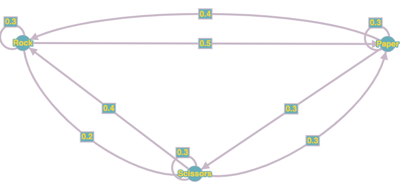
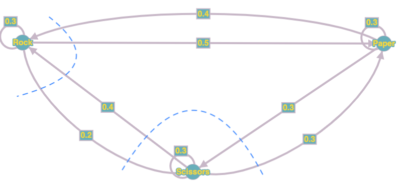

<h1>
Question 1.
</h1>
<p>
For *small packets* we have:
$\newline$

$S_{small} = 0.01ms$, $P_{small} = 0.1$.
$\newline$
$\lambda_{small} = P_{small}*\lambda = (0.1)*(8000 \frac{packet}{second} * \frac{1second}{1000ms}) = 0.8 \frac{packet}{ms}$
$\newline$
So based on Little's law:
$\newline$
$U_{small} = \lambda_{small}*S_{small} = (0.8 \frac{packets}{ms})*(0.01 ms) = 0.008$
$\newline$
$Q_{small} = \lambda_{small}*R_{small} = 0.8R_{small}$
$\newline$
Since we have a deterministic service time distribution for each class, then we have: 
$\newline$
$S_{rem_{small}} = \frac{S_{small}}{2} = \frac{0.01 ms}{2} = 0.005 ms$
$\newline$
$\newline$
For *big packets* we have:
$\newline$

$S_{big} = 0.11ms$, $P_{big} = 0.9$.
$\newline$
$\lambda_{big} = P_{big}*\lambda = (0.9)*(8000 \frac{packet}{second} * \frac{1second}{1000ms}) = 7.2 \frac{packet}{ms}$
$\newline$
So based on Little's law:
$\newline$
$U_{big} = \lambda_{big}*S_{big} = (7.2 \frac{packets}{ms})*(0.11 ms) = 0.792$
$\newline$
$Q_{big} = \lambda_{big}*R_{big} = 7.2R_{big}$
$\newline$
Since we have a deterministic service time distribution for each class, then we have: 
$\newline$
$S_{rem_{big}} = \frac{S_{big}}{2} = \frac{0.11 ms}{2} = 0.055 ms$
$\newline$

Finally for each class based on small class non-preemptive priority we have:
$\newline$
$$R_{small} = S_{small} + S_{small}*(Q_{small} - U_{small}) + U_{small}*S_{rem_{small}} + U_{big}*S_{rem_{big}}$$
$$R_{small} = 0.01 + 0.01*(0.8R_{small} - 0.008) + 0.008*0.005 + 0.792*0.055$$
</p>
```{r, message=FALSE, warning=FALSE}
Rs = (0.01 - (0.01*0.008) + (0.008*0.005) + (0.792*0.055))/(1 - 0.008)
cat("R small: ", Rs, 'milliseconds')
```
<p>
$$R_{big} = S_{big} + S_{small}*(Q_{small} - U_{small}) + S_{big}*(Q_{big} - U_{big}) + U_{small}*S_{rem_{small}} + U_{big}*S_{rem_{big}} + (R_{big} - S_{big})\lambda_{small}S_{small}$$
$$R_{big} = 0.11 + 0.01*(0.8*R_{small} - 0.008) + 0.11*(7.2R_{big} - 0.792) + 0.008*0.005 + 0.792*0.055 + (R_{big} - 0.11)*0.8*0.01$$
</p>
```{r, message=FALSE, warning=FALSE}
Rb = (0.11+(0.01*(0.8*Rs-0.008))-(0.11*0.792)+(0.008*0.005)+(0.792*0.055)-(0.11*0.8*0.01))/(1-0.8)
cat("R big: ", Rb, 'milliseconds')
```
***
<h1>
Question 2.
</h1>

<p>
$hi$
$\newline$
</p>
```{r, message=FALSE, warning=FALSE}
N = 1:30
for(i in N){
  # find max troughput based on MVA
  
}

```

***
<h1>
Question 3.
</h1>

<h2>
**a)**
</h2>
<p> This model is provided in figure 1.</p>


<h2>
**b)**
</h2>
<p>

We can obtain the following equantions by dividing the graph as in figure 2.
$$
\left\{
                \begin{array}{ll}
                  P_{rock} + P_{paper} + P_{scissors} = 1\\
                  0.4P_{paper} + 0.4P_{scissors} = 0.5P_{rock} + 0.2P_{rock}\\
                  0.2P_{rock} + 0.3P_{paper} = 0.4P_{scissors} + 0.3P_{scissors}
                \end{array}
\right.
$$
The results are $P_{rock} = \frac{4}{11}$, $P_{paper} = \frac{41}{110}$, $P_{scissors}=\frac{29}{110}$
</p>

***
<h1>
Question 4.
</h1>

<h2>
**a)**
</h2>
<p>
$hi$
$\newline$
</p>
```{r, message=FALSE, warning=FALSE}
```

<h2>
**b)**
</h2>
<p>
$hi$
$\newline$
</p>
```{r, message=FALSE, warning=FALSE}
```

***
<h1>
Question 5.
</h1>

<h2>
**a)**
</h2>

<p>
$hi$
$\newline$
</p>
```{r, message=FALSE, warning=FALSE}
```

<h2>
**b)**
</h2>

<p>
$hi$
$\newline$
</p>
```{r, message=FALSE, warning=FALSE}
```

<h2>
**c)**
</h2>

<p>
$hi$
$\newline$
</p>
```{r, message=FALSE, warning=FALSE}
```

<h2>
**d)**
</h2>

<p>
$hi$
$\newline$
</p>
```{r, message=FALSE, warning=FALSE}
```