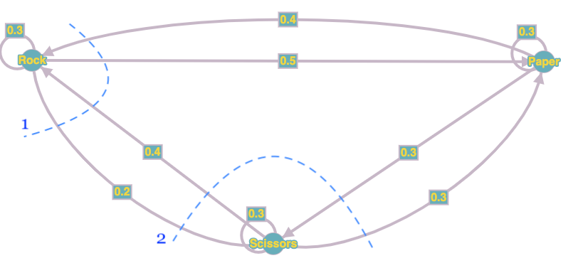

<h1>
Question 1.
</h1>
<p>
For *small packets* we have:
$\newline$

$S_{small} = 0.01ms$, $P_{small} = 0.1$.
$\newline$
$\lambda_{small} = P_{small}*\lambda = (0.1)*(8000 \frac{packet}{second} * \frac{1second}{1000ms}) = 0.8 \frac{packet}{ms}$
$\newline$
So based on Little's law:
$\newline$
$U_{small} = \lambda_{small}*S_{small} = (0.8 \frac{packets}{ms})*(0.01 ms) = 0.008$
$\newline$
$Q_{small} = \lambda_{small}*R_{small} = 0.8R_{small}$
$\newline$
Since we have a deterministic service time distribution for each class, then we have: 
$\newline$
$S_{rem_{small}} = \frac{S_{small}}{2} = \frac{0.01 ms}{2} = 0.005 ms$
$\newline$
$\newline$
For *big packets* we have:
$\newline$

$S_{big} = 0.11ms$, $P_{big} = 0.9$.
$\newline$
$\lambda_{big} = P_{big}*\lambda = (0.9)*(8000 \frac{packet}{second} * \frac{1second}{1000ms}) = 7.2 \frac{packet}{ms}$
$\newline$
So based on Little's law:
$\newline$
$U_{big} = \lambda_{big}*S_{big} = (7.2 \frac{packets}{ms})*(0.11 ms) = 0.792$
$\newline$
$Q_{big} = \lambda_{big}*R_{big} = 7.2R_{big}$
$\newline$
Since we have a deterministic service time distribution for each class, then we have: 
$\newline$
$S_{rem_{big}} = \frac{S_{big}}{2} = \frac{0.11 ms}{2} = 0.055 ms$
$\newline$

Finally for each class based on small class non-preemptive priority we have:
$\newline$
$$R_{small} = S_{small} + S_{small}*(Q_{small} - U_{small}) + U_{small}*S_{rem_{small}} + U_{big}*S_{rem_{big}}$$
$$R_{small} = 0.01 + 0.01*(0.8R_{small} - 0.008) + 0.008*0.005 + 0.792*0.055$$
</p>
```{r, message=FALSE, warning=FALSE}
Rs = (0.01 - (0.01*0.008) + (0.008*0.005) + (0.792*0.055))/(1 - 0.008)
cat("R small: ", Rs, 'milliseconds')
```
<p>
$$R_{big} = S_{big} + S_{small}*(Q_{small} - U_{small}) + S_{big}*(Q_{big} - U_{big}) + U_{small}*S_{rem_{small}} + U_{big}*S_{rem_{big}} + (R_{big} - S_{big})\lambda_{small}S_{small}$$
$$R_{big} = 0.11 + 0.01*(0.8*R_{small} - 0.008) + 0.11*(7.2R_{big} - 0.792) + 0.008*0.005 + 0.792*0.055 + (R_{big} - 0.11)*0.8*0.01$$
</p>
```{r, message=FALSE, warning=FALSE}
Rb = (0.11+(0.01*(0.8*Rs-0.008))-(0.11*0.792)+(0.008*0.005)+(0.792*0.055)-(0.11*0.8*0.01))/(1-0.8)
cat("R big: ", Rb, 'milliseconds')
```
***
<h1>
Question 2.
</h1>

<p>
$hi$
$\newline$
</p>
```{r, message=FALSE, warning=FALSE}
N = 1:30
for(i in N){
  # find max troughput based on MVA
  
}

```

***
<h1>
Question 3.
</h1>

<h2>
**a)**
</h2>
<p> This model is provided in figure 1.</p>


<h2>
**b)**
</h2>
<p>
We can obtain the following equations by dividing the graph as in figure 1.
$$
\left\{
                \begin{array}{ll}
                  P_{rock} + P_{paper} + P_{scissors} = 1\\
                  1) 0.4P_{paper} + 0.4P_{scissors} = 0.5P_{rock} + 0.2P_{rock}\\
                  2) 0.2P_{rock} + 0.3P_{paper} = 0.4P_{scissors} + 0.3P_{scissors}
                \end{array}
\right.
$$
The results are $P_{rock} = \frac{4}{11}$, $P_{paper} = \frac{41}{110}$, $P_{scissors}=\frac{29}{110}$
</p>

***
<h1>
Question 4.
</h1>

<h2>
**a)**
</h2>
<p> This model is provided in figure 2.</p>


<h2>
**b)**
</h2>
<p>
We can obtain the following equantions by dividing the graph as in figure 2.
Read rate for each processor is $\frac{1}{R}$ and Write rate for each processor is $\frac{1}{W}$.
$$
\left\{
                \begin{array}{ll}
                  S_{1} + S_{2} + S_{3} + S_{4} = 1\\
                  \\
                  1) P_{1}Eviction*S_{1} + P_{2}Eviction*S_{1} + P_{1}Write*S_{1} + P_{2}Write*S_{1} = P_{1}Read*S_{2} +  P_{2}Read*S_{3}\\
                  \rightarrow \lambda*S_{1} + \lambda*S_{1} + \frac{1}{W}*S_{1} + \frac{1}{W}*S_{1} = \frac{1}{R}*S_{2} + \frac{1}{R}*S_{3}\\
                  \\
                  2) P_{1}Read*S_{2} +  P_{2}Write*S_{2} + P_{2}Eviction*S_{2} = \\
                  P_{1}Eviction*S_{1} + P_{2}Write*S_{1} + P_{2}Write*S_{3} + P_{2}Write*S_{4} + P_{2}Read*S_{4}\\
                  \rightarrow \frac{1}{R}*S_{2} + \frac{1}{W}*S_{2} + \lambda*S_{2} = \lambda*S_{1} + \frac{1}{W}*S_{1} + \frac{1}{W}*S_{3} + \frac{1}{W}*S_{4} + \frac{1}{R}*S_{4}\\
                  \\
                  3) P_{2}Eviction*S_{1} + P_{1}Write*S_{1} + P_{1}Write*S_{2} + P_{2}Eviction*S_{2} = \\
                  P_{2}Read*S_{3} + P_{2}Write*S_{3} + P_{2}Write*S_{4} + P_{2}Read*S_{4}\\
                  \rightarrow \lambda*S_{3} + \frac{1}{W}*S_{1} + \frac{1}{W}*S_{2} + \lambda*S_{2} = \frac{1}{R}*S_{3} + \frac{1}{W}*S_{3} + \frac{1}{W}*S_{4} + \frac{1}{R}*S_{4}
                \end{array}
\right.
$$
Finally: $\newline$
$$
\left\{
                \begin{array}{ll}
                  S_{1} + S_{2} + S_{3} + S_{4} = 1\\
                  \\
                  1)2S_{1}\lambda + \frac{2S_{1}}{W} = \frac{S_{2} + S_{3}}{R}\\
                  \\
                  2) \frac{S_{2}}{R} + \frac{S_{2}}{W} + S_{2}\lambda = S_{1}\lambda + \frac{S_{1}+S_{3}+S_{4}}{W} + \frac{S_{4}}{R}\\
                  \\
                  3) S_{3}\lambda + S_{2}\lambda + \frac{S_{1}+S_{2}}{W} = \frac{S_{3}+S_{4}}{W} + \frac{S_{3}+S_{4}}{R}
                \end{array}
\right.
$$

***

<h1>
Question 5.
</h1>

<h2>
**a)**
</h2>

<p>
We define states as a set of two values, which shows requests in server 1(consider m) & server 2(consider n). Starting at (0,0) which means there is no work in both servers.

Then by rate of $\frac{\lambda}{2}$ we will have a transition to (1,0) or (0,1). Then by rate of $\frac{1}{S}$ will have a transition to (0,0) from (1,0) or (0,1). From (1,0), we might go to (2,0), (1,1) by rate of $\frac{\lambda}{2}$. From (0,1), we might go to (0,2), (1,1) by rate of $\frac{\lambda}{2}$.

So the formulation can be as following:

- State(m,n) $\rightarrow$ State(m+1,n) by rate $\frac{\lambda}{2}$
- State(m,n) $\rightarrow$ State(m,n+1) by rate $\frac{\lambda}{2}$
- State(m,n) $\rightarrow$ State(m-1,n) by rate $\frac{1}{S}$
- State(m,n) $\rightarrow$ State(m,n-1) by rate $\frac{1}{S}$


Sample diagram is shown in figure 3.</p>


<h2>
**b)**
</h2>
Again we consider the same satate definition as part a.
Starting at (0,0) which means there is no work in both servers.

Then by rate of $\frac{\lambda}{2}$ we will have a transition to (1,0) or (0,1). Then by rate of $\frac{1}{S}$ will have a transition to (0,0) from (1,0) or (0,1). From (1,0), we can't go to (2,0) in contrast with part a, however we might go to  (1,1) by rate of $\lambda$. From (0,1), we can't go to (0,2), but we might go (1,1) by rate of $\lambda$.

So the formulation can be as following:

- State(m,n) $\rightarrow$ State(m+1,n), if m = n by rate $\frac{\lambda}{2}$
- State(m,n) $\rightarrow$ State(m+1,n), if m < n by rate $\lambda$
- State(m,n) $\rightarrow$ State(m,n+1), if m = n by rate $\frac{\lambda}{2}$
- State(m,n) $\rightarrow$ State(m,n+1), if m > n by rate $\lambda$
- State(m,n) $\rightarrow$ State(m-1,n) by rate $\frac{1}{S}$
- State(m,n) $\rightarrow$ State(m,n-1) by rate $\frac{1}{S}$


Sample diagram is shown in figure 4. We should note that we can reach node (2,0) by moving to (2,1) from (1,1) by rate of $\frac{\lambda}{2}$ and then server 2 serving request by rate of $\frac{1}{S}$</p>


<h2>
**c)**
</h2>
Here we change states so that we can find previous served server (mentioned as A & B) in addition to the number of requests in each server. So our states have three values. We assume that the round robin routing starts with routing request to server 1.

Starting at (0,0,A) which means there is no work in both servers.
Then by rate of $\lambda$ we will have a transition to (1,0,A). Then by rate of $\lambda$ we will have a transition to (1,1,B). From (1,1,B) we might go to (0,1,B) or (1,0,B) by rate of $\frac{1}{S}$.

So the formulation can be as following:

- State(m,n,A) $\rightarrow$ State(m,n+1,B) by rate $\lambda$
- State(m,n,B) $\rightarrow$ State(m+1,n,A) by rate $\lambda$
- State(m,n,A) $\rightarrow$ State(m-1,n,A) by rate $\frac{1}{S}$
- State(m,n,B) $\rightarrow$ State(m,n-1,B) by rate $\frac{1}{S}$

However I think in this problem servers serving doesn't change the state and we can simply define our state space as a one dimentional value of routed server. Then by rate of $\lambda$ we move from Server A to Server B and vice-versa.
Sample diagram for 1 dimentional state is shown in figure 5.</p>


<p>
Sample diagram for 3 dimentional state is also shown in figure 6.</p>


<h2>
**d)**
</h2>

<p>
In my opinion, second routing algorithm might have better performance, because it tries to keep the utilization of the less crowded server and prevent overflowing of the more crowded server. 

Then I think third routing algorithm might have better performance than first one, because worst case of part a algorithm might end in overflowing one server severly and keeping the other server idle in this time. 
</p>
